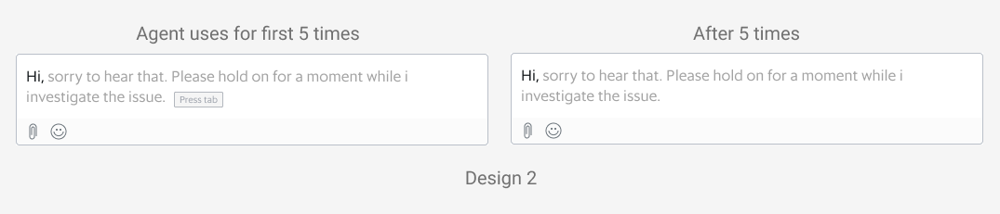

In previous articles (see [Grab's in-house chat platform](https://engineering.grab.com/how-we-built-our-in-house-chat-platform-for-the-web), [workforce routing](https://engineering.grab.com/customer-support-workforce-routing)), we shared how chat has grown to become one of the primary channels for support in the last few years.

With continuous chat growth and a new in-house tool, helping our agents be more efficient and productive was key to ensure a faster support time for our users and scale chat even further.

Starting from the analysis on the usage of another third-party tool as well as some shadowing sessions, we realised that building a templated-based feature wouldn’t help. We needed to offer personalisation capabilities, as our consumer support specialists care about their writing style and tone, and using templates often feels robotic.

We decided to build a machine learning model, called **SmartChat**, which offers contextual suggestions by leveraging several sources of internal data, helping our chat specialists type much faster, and hence serving more consumers.

In this article, we are going to explain the process from problem discovery to design iterations, and share how the model was implemented from both a data science and software engineering perspective.

## How SmartChat Works


## Diving Deeper into the Problem

Agent productivity became a key part in the process of scaling chat as a channel for support.

After splitting chat time into all its components, we noted that agent typing time represented a big portion of the chat support journey, making it the perfect problem to tackle next.

After some analysis on the usage of the third-party chat tool, we found out that even with functionalities such as canned messages, **85% of the messages were still free typed**.

Hours of shadowing sessions also confirmed that the consumer support specialists liked to add their own flair. They would often use the template and adjust it to their style, which took more time than just writing it on the spot. With this in mind, it was obvious that templates wouldn’t be too helpful, unless they provided some degree of personalisation.

We needed something that reduces typing time and also:

*   **Allows some degree of personalisation**, so that answers don’t seem robotic and repeated.
*   **Works with multiple languages and nuances**, considering Grab operates in 8 markets, even some of the English markets have some slight differences in commonly used words.
*   **It’s contextual to the problem** and takes into account the user type, issue reported, and even the time of the day.
*   **Ideally doesn’t require any maintenance effort**, such as having to keep templates updated whenever there’s a change in policies.

Considering the constraints, **this seemed to be the perfect candidate for a machine learning-based functionality**, which predicts sentence completion by considering all the context about the user, issue and even the latest messages exchanged.

## Usability is Key


To fulfil the hypothesis, there are a few design considerations:

1.  Minimising the learning curve for agents.
2.  Avoiding visual clutter if recommendations are not relevant.

To increase the probability of predicting an agent's message, one of the design explorations is to allow agents to select the top 3 predictions (Design 1). To onboard agents, we designed a quick tip to activate SmartChat using keyboard shortcuts.


By displaying the top 3 recommendations, we learnt that it slowed agents down as they started to read all options even if the recommendations were not helpful. Besides, by triggering this component upon every recommendable text, it became a distraction as they were forced to pause.

In our next design iteration, we decided to leverage and reuse the interaction of SmartChat from a familiar platform that agents are using - Gmail’s Smart Compose. As agents are familiar with Gmail, the learning curve for this feature would be less steep. For first time users, agents will see a “Press tab” tooltip, which will activate the text recommendation. The tooltip will disappear after 5 times of use.



To relearn the shortcut, agents can hover over the recommended text.

## How We Track Progress

Knowing that this feature would come in multiple iterations, we had to find ways to track how well we were doing progressively, so we decided to measure the different components of chat time.

We realised that the agent typing time is affected by:

*   **Percentage of characters saved**. This tells us that the model predicted correctly, and also saved time. This metric should increase as the model improves.
*   **Model’s effectiveness**. The agent writes the least number of characters possible before getting the right suggestion, which should decrease as the model learns.
*   **Acceptance rate**. This tells us how many messages were written with the help of the model. It is a good proxy for feature usage and model capabilities.
*   **Latency**. If the suggestion is not shown in about 100-200ms, the agent would not notice the text and keep typing.

## Architecture


The architecture involves support specialists initiating the fetch suggestion request, which is sent for evaluation to the machine learning model through API gateway. This ensures that only authenticated requests are allowed to go through and also ensures that we have proper rate limiting applied.

We have an internal platform called **Catwalk**, which is a microservice that offers the capability to execute machine learning models as a HTTP service. We used the Presto query engine to calculate and analyse the results from the experiment.

## Designing the Machine Learning Model

I am sure all of us can remember an experiment we did in school when we had to catch a falling ruler. For those who have not done this experiment, feel free to try [it](https://www.youtube.com/watch?v%3DLheOjO2DJD0) at home! The purpose of this experiment is to define a ballpark number for typical human reaction time (equations also included in the video link).

Typically, the human reaction time ranges from 100ms to 300ms, with a median of about 250ms (read more [here](https://www.ncbi.nlm.nih.gov/pmc/articles/PMC4374455/)). Hence, we decided to set the upper bound for SmartChat response time to be 200ms while deciding the approach. Otherwise, the experience would be affected as the agents would notice a delay in the suggestions. To achieve this, we had to manage the model’s complexity and ensure that it achieves the optimal time performance.

Taking into consideration network latencies, the machine learning model would need to churn out predictions in less than 100ms, in order for the entire product to achieve a maximum 200ms refresh rate.

As such, a few key components were considered:

*   Model Tokenisation
    *   Model input/output tokenisation needs to be implemented along with the model's core logic so that it is done in one network request.
    *   Model tokenisation needs to be lightweight and cheap to compute.

*   Model Architecture
    *   This is a typical sequence-to-sequence (seq2seq) task so the model needs to be complex enough to account for the auto-regressive nature of seq2seq tasks.
    *   We could not use pure attention-based models, which are usually state of the art for seq2seq tasks, as they are bulky and computationally expensive.

*   Model Service
    *   The model serving platform should be executed on a low-level, highly performant framework.

Our proposed solution considers the points listed above. We have chosen to develop in Tensorflow (TF), which is a well-supported framework for machine learning models and application building.

For Latin-based languages, we used a simple whitespace tokenizer, which is serialisable in the TF graph using the `tensorflow-text` package.

```
import tensorflow_text as text

tokenizer = text.WhitespaceTokenizer()
```

For the model architecture, we considered a few options but eventually settled for a simple recurrent neural network architecture (RNN), in an Encoder-Decoder structure:

*   **Encoder**
    *   Whitespace tokenisation
    *   Single layered Bi-Directional RNN
    *   Gated-Recurrent Unit (GRU) Cell

*   **Decoder**

    *   Single layered Uni-Directional RNN
    *   Gated-Recurrent Unit (GRU) Cell

*   **Optimisation**
    *   Teacher-forcing in training, Greedy decoding in production
    *   Trained with a cross-entropy loss function
    *   Using ADAM (Kingma and Ba) optimiser

**Features**

To provide context for the sentence completion tasks, we provided the following features as model inputs:

*   Past conversations between the chat agent and the user
*   Time of the day
*   User type (Driver-partners, Consumers, etc.)
*   Entrypoint into the chat (e.g. an article on cancelling a food order)

These features give the model the ability to generalise beyond a simple language model, with additional context on the nature of contact for support. Such experiences also provide a better user experience and a more customised user experience.

For example, the model is better aware of the nature of time in addressing “Good **{Morning/Afternoon/Evening}**” given the time of the day input, as well as being able to interpret meal times in the case of food orders. E.g. “We have contacted the driver, your **{breakfast/lunch/dinner}** will be arriving shortly”.

## Typeahead Solution for the User Interface

With our goal to provide a seamless experience in showing suggestions to accepting them, we decided to implement a typeahead solution in the chat input area. This solution had to be implemented with the ReactJS library, as the internal web-app used by our support specialist for handling chats is built in React.

There were a few ways to achieve this:

1.  Modify the Document Object Model (DOM) using Javascript to show suggestions by positioning them over the `input` HTML tag based on the cursor position.
2.  Use a content editable `div` and have the suggestion `span` render conditionally.

After evaluating the complexity in both approaches, the second solution seemed to be the better choice, as it is more aligned with the React way of doing things: avoid DOM manipulations as much as possible.

However, when a suggestion is accepted we would still need to update the content editable div through DOM manipulation. It cannot be added to React’s state as it creates a laggy experience for the user to visualise what they type.

Here is a code snippet for the implementation:

```
import React, { Component } from 'react';
import liveChatInstance from './live-chat';

export class ChatInput extends Component {
 constructor(props) {
   super(props);
   this.state = {
     suggestion: '',
   };
 }

 getCurrentInput = () => {
   const { roomID } = this.props;
   const inputDiv = document.getElementById(`input_content_${roomID}`);
   const suggestionSpan = document.getElementById(
     `suggestion_content_${roomID}`,
   );

   // put the check for extra safety in case suggestion span is accidentally cleared
   if (suggestionSpan) {
     const range = document.createRange();
     range.setStart(inputDiv, 0);
     range.setEndBefore(suggestionSpan);
     return range.toString(); // content before suggestion span in input div
   }
   return inputDiv.textContent;
 };

 handleKeyDown = async e => {
   const { roomID } = this.props;
   // tab or right arrow for accepting suggestion
   if (this.state.suggestion && (e.keyCode === 9 || e.keyCode === 39)) {
     e.preventDefault();
     e.stopPropagation();
     this.insertContent(this.state.suggestion);
     this.setState({ suggestion: '' });
   }
   const parsedValue = this.getCurrentInput();
   // space
   if (e.keyCode === 32 && !this.state.suggestion && parsedValue) {
     // fetch suggestion
     const prediction = await liveChatInstance.getSmartComposePrediction(
       parsedValue.trim(), roomID);
     this.setState({ suggestion: prediction })
   }
 };

 insertContent = content => {
   // insert content behind cursor
   const { roomID } = this.props;
   const inputDiv = document.getElementById(`input_content_${roomID}`);
   if (inputDiv) {
     inputDiv.focus();
     const sel = window.getSelection();
     const range = sel.getRangeAt(0);
     if (sel.getRangeAt && sel.rangeCount) {
       range.insertNode(document.createTextNode(content));
       range.collapse();
     }
   }
 };

 render() {
   const { roomID } = this.props;
   return (
     <div className="message_wrapper">
       <div
         id={`input_content_${roomID}`}
         role={'textbox'}
         contentEditable
         spellCheck
         onKeyDown={this.handleKeyDown}
       >
         {!!this.state.suggestion.length && (
           <span
             contentEditable={false}
             id={`suggestion_content_${roomID}`}
           >
             {this.state.suggestion}
           </span>
         )}
       </div>
     </div>
   );
 }
}

```

The solution uses the spacebar as the trigger for fetching the suggestion from the ML model and stores them in a React state. The ML model prediction is then rendered in a dynamically rendered span.

We used the [window.getSelection()](https://developer.mozilla.org/en-US/docs/Web/API/Window/getSelection) and [range](https://developer.mozilla.org/en-US/docs/Web/API/Selection/getRangeAt) APIs to:

*   Find the current input value
*   Insert the suggestion
*   Clear the input to type a new message

The implementation has also considered the following:

*   **Caching**. API calls are made on every space character to fetch the prediction. To reduce the number of API calls, we also cached the prediction until it differs from the user input.
*   **Recover placeholder**. There are data fields that are specific to the agent and consumer, such as agent name and user phone number, and these data fields are replaced by placeholders for model training. The implementation recovers the placeholders in the prediction before showing it on the UI.
*   **Control rollout**. Since rollout is by percentage per country, the implementation has to ensure that only certain users can access predictions from their country chat model.
*   **Aggregate and send metrics**. Metrics are gathered and sent for each chat message.

## Results

The initial experiment results suggested that we managed to save 20% of characters, which improved the **efficiency of our agents by 12%** as they were able to resolve the queries faster. These numbers exceeded our expectations and as a result, we decided to move forward by rolling SmartChat out regionally.

## What’s Next?

In the upcoming iteration, we are going to focus on **non-Latin language support**, **caching**, and **continuous training**.

*Non-Latin Language Support and Caching*

The current model only works with Latin languages, where sentences consist of space-separated words. We are looking to provide support for non-Latin languages such as Thai and Vietnamese. The result would also be cached in the frontend to reduce the number of API calls, providing the prediction faster for the agents.

*Continuous Training*

The current machine learning model is built with training data derived from historical chat data. In order to teach the model and improve the metrics mentioned in our goals, we will enhance the model by letting it learn from data gathered in day-to-day chat conversations. Along with this, we are going to train the model to give better responses by providing more context about the conversations.

Seeing how effective this solution has been for our chat agents, we would also like to expose this to the end consumers to help them express their concerns faster and improve their overall chat experience.

----
<small class="credits">Special thanks to [Kok Keong Matthew Yeow](mailto:matthew.yeow@grabtaxi.com), who helped to build the architecture and implementation in a scalable way.</small>
----

## Join Us

Grab is a leading superapp in Southeast Asia, providing everyday services that matter to consumers. More than just a ride-hailing and food delivery app, Grab offers a wide range of on-demand services in the region, including mobility, food, package and grocery delivery services, mobile payments, and financial services across over 400 cities in eight countries.

Powered by technology and driven by heart, our mission is to drive Southeast Asia forward by creating economic empowerment for everyone. If this mission speaks to you, [join our team](https://grab.careers/) today! 
